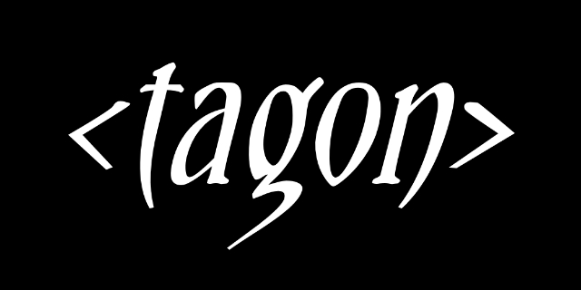

# Welcome to TAGON 



### TAGON is a powerful addon to your html code which is written in javascript that provides you the modern functionalities in a simplified way also it's a free and Open source project

made with ❤ for the developers by [MANIKANDAN SRINIVASALU](https://www.linkedin.com/in/manikandansrinivasalu/)
# CDN
```html
<script src="https://cdn.jsdelivr.net/gh/MANIKANDANMLT/tagon@main/file/tagon.js"></script>
```
minify cdn
```html
<script src="https://cdn.jsdelivr.net/gh/MANIKANDANMLT/tagon@main/file/tagon.min.js"></script>
```
# NPM
```node
npm i tagon
```
[NPM link](https://www.npmjs.com/package/tagon)
## Effects tags

- ### blur-it
this tag helps to blur the content in a html page

```html
    <blue-it value="2">
        sample text
    </blue-it>
```
| attribute    | value |
| :--------: | :-------: |
| value  | 0.1 to n |

## popup tags
- ### text-popup
this element helps to popup an ALERT-BOX with a msg and you may also redirect the page after the selection of ok button in the popup box

```html
    <text-popup msg="your msg" goto="<filepath>">
        sample text
    </text-popup>
```
| attribute    | value |
| :--------: | :-------: |
| msg  | you can writ e any message to it |
| goto  | the path EG: "/static/about.html" |

## Transition tags

## some common Transition attributes
# note: * the tag must contain all the attributes as mentioned in the samplecode *


| attribute    | value |
| :--------: | :-------: |
| duration  | starts from 0 (1000 = 1s) |
| loop  | no.of.times 1,2...N values (or) Infinity |
| animetype  | ease-in, ease-out, linear, ease-in-out |
| deg  | -x to x where { x = 0 to N values } |
| move  | -x to x values (default **px**) |

- ### move-v 
this tag helps you to move your content - **vertically** 
```html
<move-v move="100" duration="2000" animetype="linear" loop="Infinity">sample text</move-v>
```
- ### move-h
this tag helps you to move your content - **horizontally** 
```html
<move-h move="-100" duration="2000" animetype="ease-in" loop="1">sample text</move-h>
```
- ### scale-v 
this tag helps you to scale your content - **vertically** 
```html
<scale-v scale="2" duration="2000" animetype="linear" loop="Infinity">sample text</scale-v>
```
- ### scale-h
this tag helps you to scale your content - **horizontally** 
```html
<scale-h scale="3" duration="2000" animetype="ease-in" loop="1">sample text</scale-h>
```
- ### scale-it 
this tag helps you to scale your content - both **vertically** and **horizontally** 
```html
<scale-it scale="2" duration="2000" animetype="linear" loop="Infinity">sample text</scale-it>
```
- ### rotate-it
this tag helps you to animate your content - **rotate to a degree** 
```html
<rotate-it deg="-100" duration="2000" animetype="ease-in-out" loop="1">sample text</rotate-it>
```
- ### rotate-tostart
this tag helps you to animate your content - **rotate to a degree and comes back to the start position** 
```html
<rotate-it deg="-100" duration="2000" animetype="ease-in-out" loop="1">sample text</rotate-it>
```
- ### whats-app
this tag helps you to directly access the chat page of the service provider
```html
<whats-app number="091234567890" msg="hello" content="any content" image="path/sample.png" imgh="30px" imgw="30px" instyle="any-css-styling"></whats-app>
```
| attribute    | value |
| :--------: | :-------: |
| number  | whatsapp number with country code |
| msg  | the predefined message you wish to get|
| content  | to display in the html page (use " " if no content)|
| image  | add png/jpg img (use " " if no image)|
| imgh  | height of image in px eg: 20px |
| imgw  | width of image in px eg: 20px |
| instyle  | write your custom css style for the content |

- ### time-line
this tag helps you to write a simple timeline
```html
<time-line info="2024" title="Project begin" detail="description about the title" side="left"></time-line>
```
| attribute    | value |
| :--------: | :-------: |
| info  | timeline info eg:2003 , date , text etc |
| title  | heading |
| detail  | description about the timeline |
| side  | left or right |
| icon  | image (use " " if no image)|
|**want to style ?**|**do it with given below attributes**|
|infocolor, titlecolor, detailcolor, iconcolor| to color the fonts|
| infomoveh, infomovev ,iconmove | move in directions (default **px**)|
| iconheight, iconwidth, iconradius, iconborder  | border use css style (use " " if no needed) eg:2px solid black|

- ### read-json, read-xml , read-csv
all these read tags helps you to display their respective data in an html page
```html
<read-json src="path/file.json"></read-json>
<read-xml src="path/file.xml"></read-xml>
<read-csv src="path/file.csv"></read-csv>
```
| attribute    | value |
| :--------: | :-------: |
| src  | use local file or apis both works eg:jsonapi|
|**this is only for**|**-read-csv-**|
| thborder, tdborder | border with css eg:2px solid black |
| thpad, tdpad| padding eg30px |
| thbgcolor, thbgcolor | all color |
| thalign, tdalign | left,center,right |

- ### net-info
this tag displays the connectivity of the page to the network as offline / online  and
it displays on the screen only for 4 seconds if you need you can apply css styling to it 
```html
<net-info styleoff="write css for offline"
 styleon="write css for online"></net-info>
```

- ### go-up
this tag push you to the top of the page and completely customizable by css
```html
<go-up text="write your text"></-up>
```

- ### scroll-progress
this tag displays the progess of the page scrolling and it is fixed at the top 
```html
<scroll-progress barcolor="grey" progresscolor="violet" barheight="5px"></scroll-progress>
```
| attribute    | value |
| :--------: | :-------: |
| barcolor  | secondary or basecolor|
| progresscolor  | primary or moving color|
| barheight | height of the scroll progressbar|
